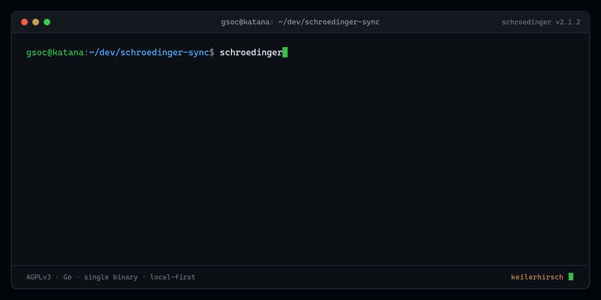
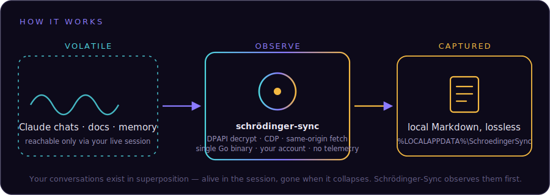

<div align="center">
  <picture>
    <source media="(prefers-color-scheme: dark)" srcset="docs/logo-dark.svg">
    
  </picture>
</div>

<p align="center"><em>Your Claude conversations live in superposition — capture them to local Markdown before the session collapses.</em></p>

<p align="center">
  <a href="https://github.com/KeilerHirsch-Labs/schroedinger-sync/actions/workflows/ci.yml"></a>
  <a href="LICENSE"></a>
</p>

> [!IMPORTANT]
> Find this useful? You can support development on **[Ko-fi](https://ko-fi.com/keilerhirsch)** ☕ — please mention *Schrödinger-Sync* so I know what to keep building.

<p align="center"></p>

Exports your own claude.ai conversations, project knowledge docs, and memory to local
Markdown — for feeding into your own local AI memory system (e.g.
[MemPalace](https://github.com/MemPalace/mempalace)). Windows-only, single Go binary.

## Why this exists

Claude today is three separate products that don't talk to each other: claude.ai Web,
Claude Desktop, and Claude Code (VS Code/CLI). Use more than one of them — most power
users do — and each surface holds its own account state and conversation history, with
nothing bridging them natively.

If you've built a local, persistent memory store on the Claude Code side (a semantic
search over your own project history, decisions, past sessions), that gap turns very
concrete: Claude Code queries years of accumulated context in a few hundred
milliseconds. A claude.ai Web or Desktop session running in parallel on the exact same
account has none of it — no shared filesystem, no shared MCP server, no query path into
the other surface's memory.

The tax shows up every time something changes on one side and needs to reach the
other: writing a summary by hand, opening the other surface, pasting it in, hoping it's
read before that session goes stale too. That's not hypothetical friction — it's the
literal manual workaround this project replaces. Multiply it by however often a real
workflow crosses surfaces, and it's recurring, unpaid busywork — exactly what an AI
assistant is supposed to remove, not create.

Schrödinger-Sync closes that gap from the Web/Desktop side: it exports what claude.ai
already knows — conversations, project docs, memory — into a local, greppable,
version-controlled Markdown store that a memory system like MemPalace can ingest. Point
Claude Code at the same store, and continuity across all three surfaces stops depending
on a human being the sync layer.

> [!NOTE]
> **Early Access.** The harvest/export core is stable and covered by tests, but the
> project is still actively evolving — expect breaking changes between minor versions
> until v3.
>
> **Roadmap:**
> 1. A native MemPalace ingest handshake so exports feed straight in without a format
>    detour, verified rather than assumed: a SHA-256 hash of the source content taken
>    before ingest and compared against a re-hash read back from the (encrypted) store
>    after — a binary pass/fail, reported as an X/Y scorecard per sync batch, not a "should
>    be lossless" claim.
>    **Write side shipped (v2.2.0):** every exported file's SHA-256 is now recorded in
>    `outDir/.content-hashes.json` at write time (`integrity.go`), crash-safe by design
>    (saved per-file, not batched, so an interrupted harvest never loses a hash for a file
>    already on disk). The **read-back half is still open** — a re-hash from MemPalace's
>    own store, compared against this manifest, reported as the X/Y scorecard — because it
>    needs a matching change on the ingest side (a separate repo); tracked, not forgotten.
> 2. A native bridge so a claude.ai Web/Desktop session can *query* a running local
>    MemPalace instance directly, not just feed it one-way via the ingest handshake above:
>    the machine already running MemPalace exposes it as a remote MCP endpoint over a
>    tunnel (Cloudflare Tunnel / Tailscale Funnel — no port-forwarding, no VPS, home IP
>    never touches DNS). A read-only tool allowlist sits at the gateway (status/search/list
>    only) because claude.ai's server-side read/write lock is a Team/Enterprise feature,
>    not available on an individual plan. This is the direct fix for the gap described in
>    "Why this exists" above — point 1 gets data *into* MemPalace, this gets it back *out*
>    to Web/Desktop.
> 3. App-managed encryption at rest for the local data store and `desktop-chats/` exports
>    — envelope encryption: a random AES-256 data key wraps the exports (AES-256-GCM),
>    itself wrapped by a non-exportable, TPM-resident key via Windows CNG's Platform Crypto
>    Provider (NCrypt) or a raw TPM 2.0 command channel, with a DPAPI-CurrentUser copy as
>    fallback. BitLocker alone doesn't satisfy strict enterprise reviewers — full-disk
>    encryption only protects a powered-off, stolen drive; once Windows is running, it
>    decrypts transparently for any authenticated process on the machine, which is exactly
>    the multi-user/malware/forensic-live-mount threat model banks, law firms and hospitals
>    actually test for.
>    **Library choice, verified against source (2026-07-19), not assumed:** no pure-Go
>    library wraps NCrypt/the Platform Crypto Provider directly. `microsoft/go-crypto-winnative`
>    was considered and ruled out — its `cng` package (inspected file-by-file) implements
>    only symmetric/asymmetric primitives (AES, RSA, ECDSA, HMAC, …) for FIPS-mode Go
>    builds, zero NCrypt/PCP surface, confirmed by a zero-result code search for
>    `NCryptOpenStorageProvider` in that repo. `golang.org/x/sys/windows` doesn't ship
>    NCrypt bindings either — only the generic LazyDLL syscall mechanism a hand-rolled
>    NCrypt layer would sit on top of. The lower-effort path with no missing-library
>    problem: `google/go-tpm`'s `legacy/tpm2` package, which opens a genuine Windows TPM
>    2.0 channel via `Tbs.dll` (its own `open_windows.go` calls straight into
>    `tpmutil/tbs`) — raw TPM 2.0 commands instead of the NCrypt/PCP abstraction, but real
>    and working today. `go-tpm`'s newer TPMDirect API is still labeled prototype by its
>    own README (as of 2026-06); stick to `legacy/tpm2`.
> 4. **Resolved, not just a maybe:** Ada/SPARK stays a conceptual reference only, never a
>    rewrite target. SPARK (the formally-verifiable Ada subset) can prove real properties
>    about the ~50 lines of key-wrap glue code itself — provable zeroization, provable
>    absence of an unintended information flow — but it cannot prove anything about the TPM
>    channel on the other side of the FFI call, which is the piece whose correctness
>    the security claim actually rests on, in any language. Reuse-first also points hard at
>    Go: zero existing permissively-licensed Ada/SPARK bindings for Windows TBS/NCrypt
>    exist to build on, versus Go's already-working `google/go-tpm` `legacy/tpm2` path above.
> 5. The DPAPI-decrypted sessionKey currently lives as a plain Go `string` (immutable,
>    GC-managed, no guaranteed erasure) between `readSessionKey()` and `setCookieAction()`.
>    Doesn't defend against a memory dump taken by something already running as the same
>    logged-in user — SECURITY.md says so today — but the next hardening step is holding it
>    as `[]byte` and actively zeroing it after use instead of trusting the GC.
>
> **Target audience:** built for individuals first (free, AGPLv3, forever) — a commercial
> licence exists for organisations that need to embed or network-deploy a modified version
> without AGPLv3's copyleft obligations. The two sharpest buyers: **law firms and other
> professional-secrecy holders** (German §203 StGB makes disclosure of client secrets a
> criminal offence, not just a GDPR fine — §43e BRAO restricts external AI processors
> accordingly) and **healthcare** (§393 SGB V effectively requires BSI C5 certification for
> cloud services touching health data since mid-2025). Behind those two: banks/insurers
> (BAIT/VAIT/DORA auditability) and KRITIS/NIS2 operators (supply-chain liability reaching
> named executives). The wedge underneath all of them: **"data residency" is not "data
> sovereignty"** — an EU-hosted cloud instance is still subject to the US CLOUD Act, which
> a fully local, zero-network-egress tool structurally isn't.
>
> **Coverage caveat:** the "no separate Cowork/Code/Design store" claim below was
> verified against the API on 2026-07-02 (`platform` field only ever CLAUDE_AI/VOICE).
> Claude Desktop's UI has visibly grown since (Projects/Artifacts/Scheduled/Send tabs) —
> re-run `probe` against a current account before relying on that claim; if a surface
> turns out to live outside `chat_conversations`, harvesting it is not yet covered.

See [CHANGELOG.md](CHANGELOG.md) for what's new in v2 versus the retired v1
(VS Code extension + Python CLI).

**Read [SECURITY.md](SECURITY.md) before running this.** This tool decrypts a
DPAPI-protected credential store — the same primitive class as credential-stealing
malware. SECURITY.md explains exactly why it can only ever be used against your own
account, and how that's enforced in code, not just promised in prose.

## What it exports

- **Conversations** — every chat_conversation on your account, full turn history
  including tool calls/results, converted to per-conversation Markdown.
- **Project knowledge docs** — every file attached to your claude.ai Projects.
- **Memory** — the claude.ai memory feature's current content.

There is no separate "Cowork"/"Code"/"Design" store to export from — those surfaces
live inside the same `chat_conversations` API, distinguished only by a `platform` field
(`CLAUDE_AI` / `VOICE`). One harvest command covers all of it.

## How it works (short version)

<div align="center">
  
</div>

1. Decrypts your own `sessionKey` cookie from Claude Desktop's local, DPAPI-encrypted
   cookie store (`readSessionKey()` in `main.go`) — requires Desktop to be **closed**
   (Chromium holds the file locked while it runs).
2. Launches a real, visible Chrome, injects that cookie, navigates to claude.ai — Chrome
   clears Cloudflare's JS challenge itself and earns a fresh `cf_clearance` (`cdp.go`).
3. Uses same-origin in-page `fetch()` calls against claude.ai's own API to pull
   conversations, project docs, and memory.
4. Writes everything to `%LOCALAPPDATA%\SchroedingerSync\desktop-chats\` as Markdown
   — a stable per-user path, not the current working directory (see `defaultOutDir()`
   in `daemon.go`). Override with an explicit `outDir` argument where commands accept one.

## Requirements

- Windows 10/11, x64.
- Claude Desktop installed (the tool reads its local, DPAPI-encrypted cookie
  store — nothing else counts as a valid source).
- Google Chrome installed (CDP needs a real browser to clear Cloudflare's JS
  challenge; see "How it works" above).

## Installation

**Recommended — installer:** grab `SchroedingerSyncSetup.exe` from the
[latest release](https://github.com/KeilerHirsch-Labs/schroedinger-sync/releases/latest)
and run it. Per-user, no admin rights needed. It installs to
`%LOCALAPPDATA%\SchroedingerSync`, optionally adds a desktop icon, and
optionally registers itself to start in the tray on logon — all opt-in
checkboxes in the wizard, nothing silent. Uninstalling never touches your
already-harvested data.

**Unsigned — SmartScreen will warn.** Neither `schroedinger-sync.exe` nor
`SchroedingerSyncSetup.exe` is code-signed (no cert, no bought-and-forgotten EV
"trust" — that stopped bypassing SmartScreen in 2024 anyway). Verify what you
downloaded against `SHA256SUMS` in the same release before running it:
`certutil -hashfile <file> SHA256` (Windows) and compare by eye.

**From source — for anyone who wants to read the code before running it:**

```
go build -trimpath -ldflags "-s -w" -o schroedinger-sync.exe .
# -trimpath: strips local filesystem paths from the binary (no build-machine info leaks)
# -s -w: strips debug symbols/DWARF (smaller binary; nothing to reverse-engineer for free)
```

## Usage

```
.\schroedinger-sync.exe            # auth smoke test (org + first 3 conversation titles)
.\schroedinger-sync.exe harvest    # full export: chats + project docs + memory
.\schroedinger-sync.exe probe      # dump the raw API schema + scan for new surfaces
.\schroedinger-sync.exe supervise  # what install-task registers: syncs only while Desktop/VS Code is open
.\schroedinger-sync.exe watch      # headless live-sync daemon, no GUI, runs forever once started
.\schroedinger-sync.exe tray       # same daemon, with a system-tray icon — manual/always-on use
```

All commands require Claude Desktop to be **closed** — the cookie store is locked
while it's running (see SECURITY.md, "It cannot target another user's account").

## Live sync (`supervise` / `tray` / `watch`)

```
.\schroedinger-sync.exe install-task                          # register logon autostart (uses supervise)
.\schroedinger-sync.exe uninstall-task
.\schroedinger-sync.exe supervise [outDir] [intervalMinutes]   # what install-task registers
.\schroedinger-sync.exe tray [outDir] [intervalMinutes]        # visible tray icon, manual/always-on
.\schroedinger-sync.exe watch [outDir] [intervalMinutes]       # headless, always-on — default interval: 30 min
```

`supervise` is the autostart mode: it stays resident at logon but only runs sync cycles
while Claude Desktop or VS Code is actually open, and goes idle — no Chrome, no network,
just a cheap process-list poll every 20s — once neither has been seen for a few
consecutive polls. `tray`/`watch` are the always-on modes for a manual, foreground run;
`tray` additionally puts an icon in the notification area with a right-click menu: "Jetzt
synchronisieren" (sync now), "Status anzeigen" (toast with the last cycle's result), "Logs
öffnen" (opens sync.log), "Beenden" (quit). All three share the exact same sync engine
(`runCycle` in `daemon.go`).

The engine also checks whether Claude Desktop is currently running before every cycle
(`isDesktopRunning()` in `daemon.go`) and skips cleanly if it is — no failed sync
attempts, no popped-up Chrome window while you're actively using Desktop. It only
actually syncs in the windows where Desktop happens to be closed. If you keep Desktop
open most of the time, sync cycles will fire rarely by design — use `harvest` on demand
for anything time-sensitive.

Project docs and memory are refreshed once every 24h (they change far less often than
chats), independent of the chat-sync cycle.

## Testing

```
go test -v ./...
```

Runs the security invariant tests described in SECURITY.md — redaction, the hardcoded
headless flag, the claude.ai-only network egress check, and the non-importable-package
check.

## Scope

Claude/Anthropic only, for now. See SECURITY.md "Scope" section.

## License

**Dual-licensed.**

- **Open source — [GNU AGPLv3](LICENSE):** free forever for individuals and for any
  use that honours the AGPL's copyleft (including its network/SaaS clause). Run it,
  read it, modify it, self-host it at no cost. The individual tool will always have a
  free, open edition.
- **Commercial — [COMMERCIAL-LICENSE.md](COMMERCIAL-LICENSE.md):** organisations that
  want to embed or redistribute Schrödinger-Sync inside a **closed-source or SaaS
  product** — without taking on the AGPL's obligation to release their own source —
  can obtain a separate commercial licence.

Copyright © 2026 KeilerHirsch. All external contributions are governed by the
[Contributor License Agreement](CLA.md), which keeps the relicensing right
consolidated so the dual-licence can exist. See [CONTRIBUTING.md](CONTRIBUTING.md)
and SECURITY.md's "Business model" section for the reasoning.
